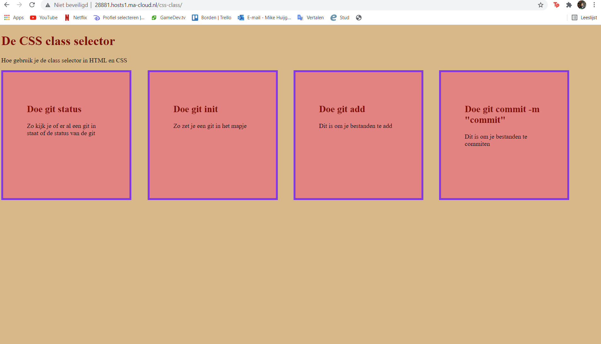
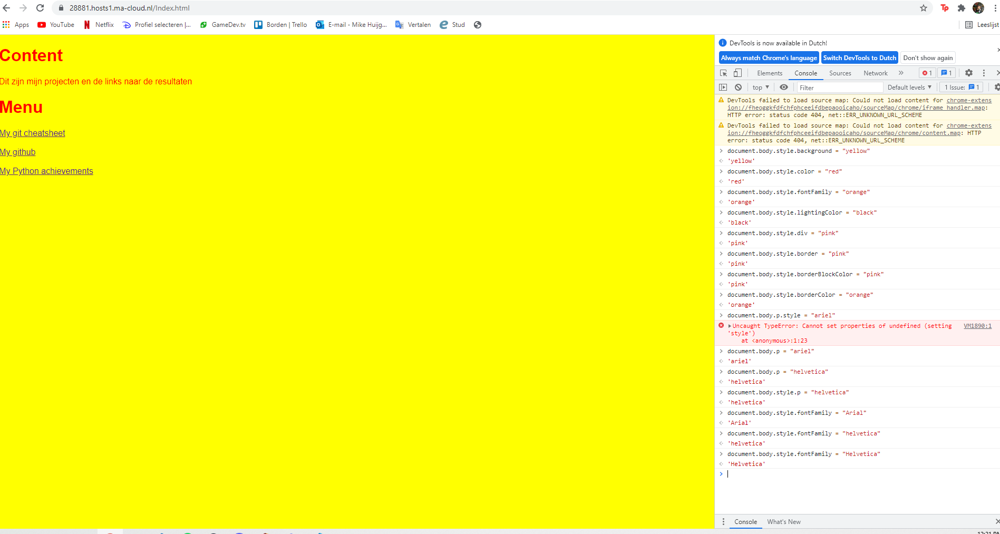

# Dit is een screenshot voor de verandering!
# 

# Dit is een screenshot na de verandering!
# 

# Dit heb ik gedaan
## Heb op f12 gedrukt en ben naar de console gegaan
## Na dat heb ik de kleur van de background aangepast met document.body.style.backgroundcolor = "yellow"
## Na dat heb ik de kleur van de letters aangepast met document.body.style.color = "red"
## Daarna heb ik het letter type veranderd met document.body.style.fontFamily = "Arial"